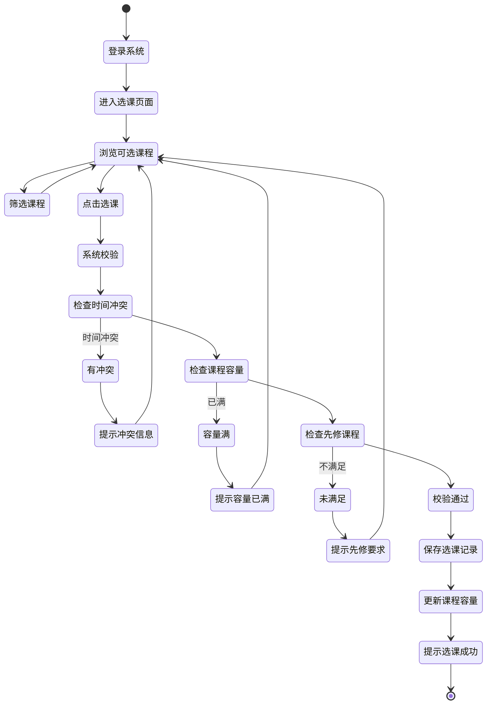
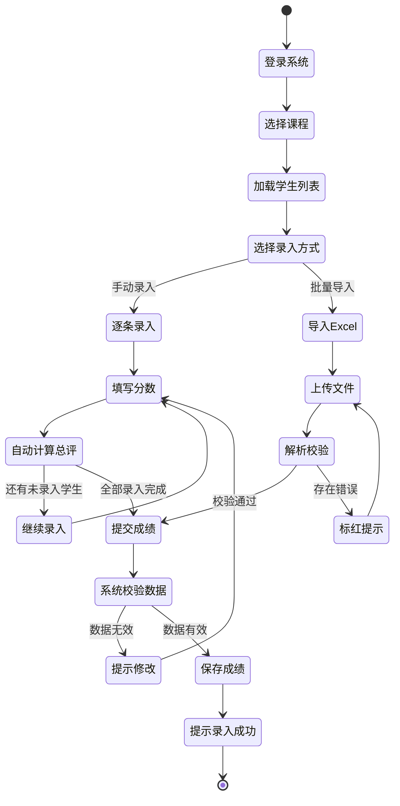
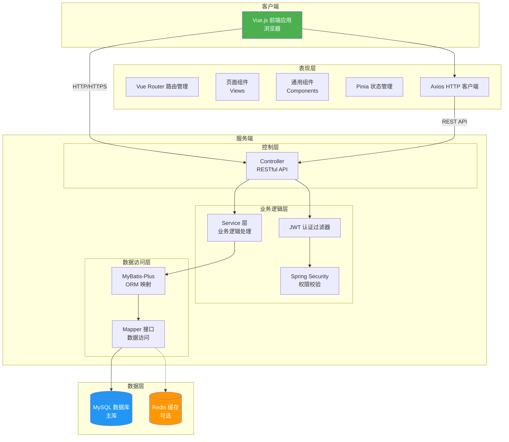
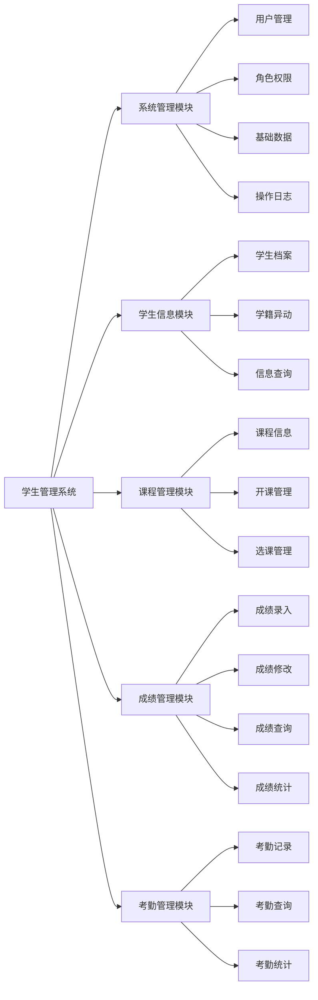
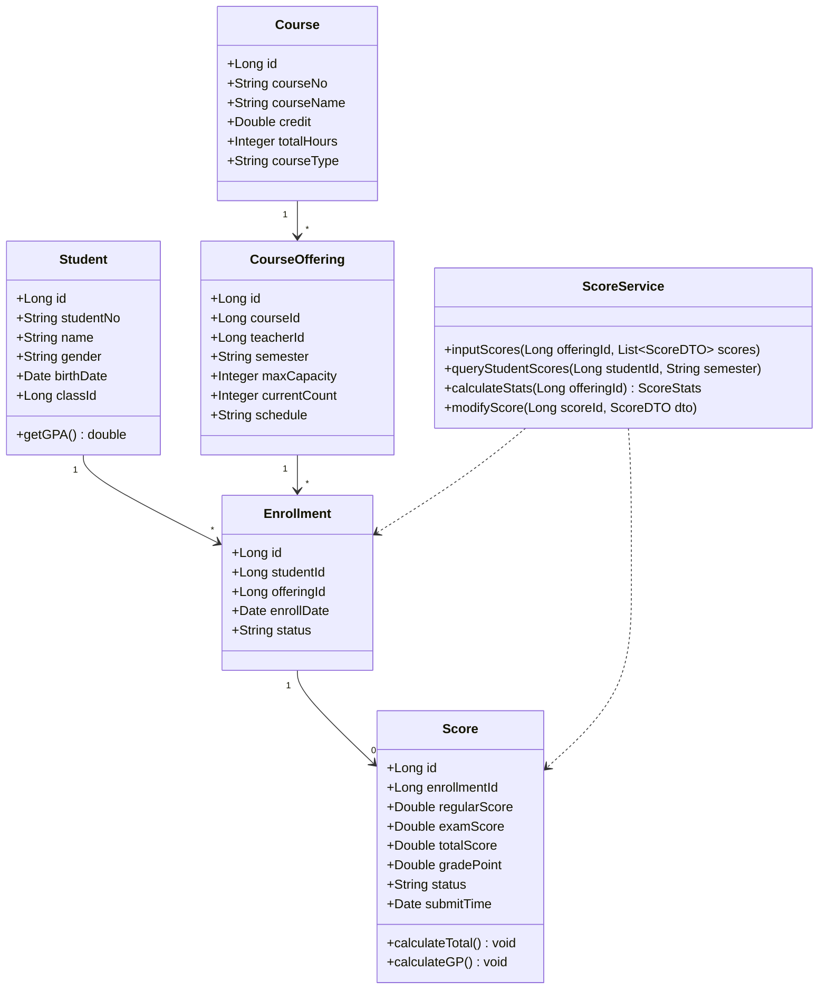
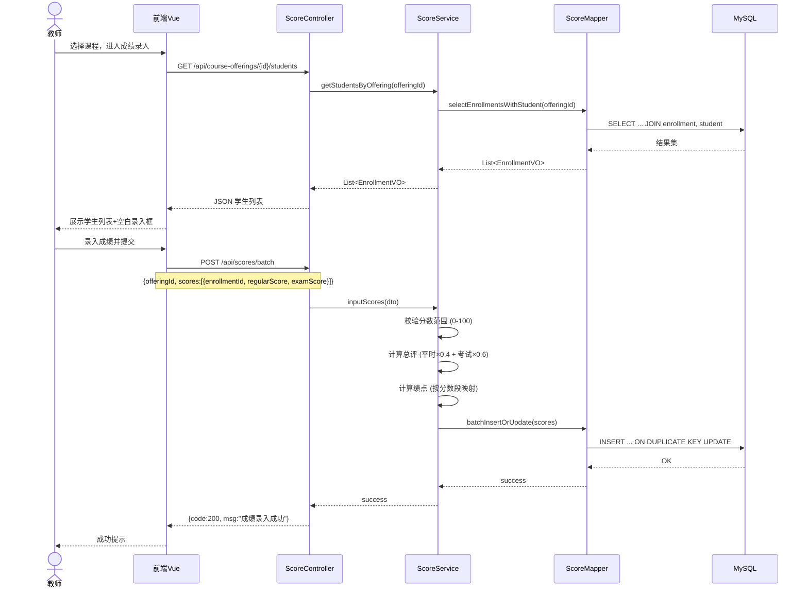
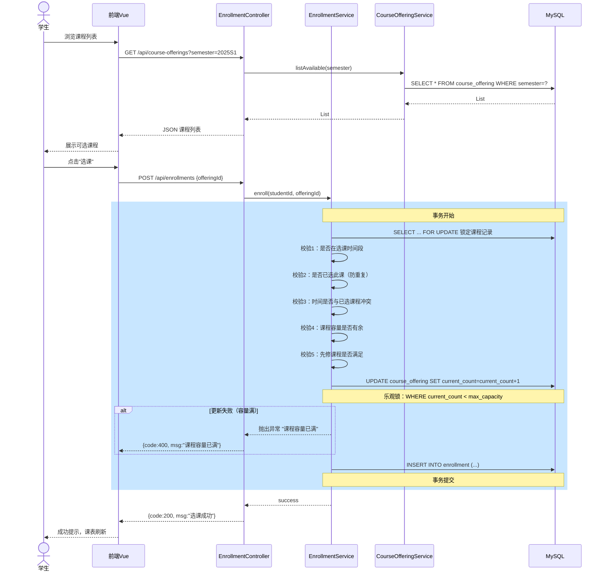
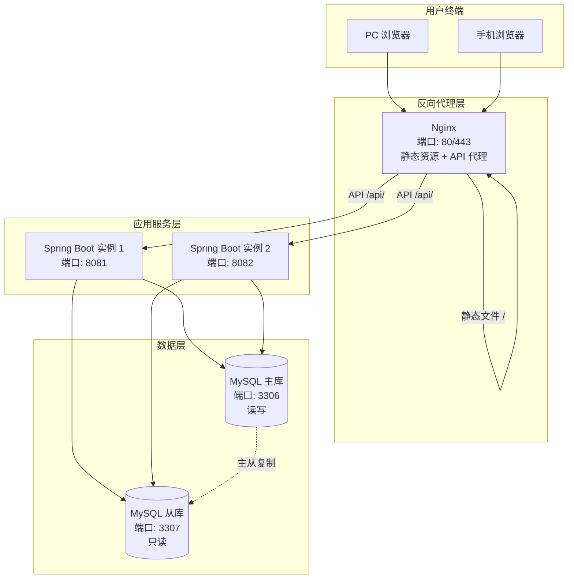

# 学生管理系统设计文档

---

## 1. 引言

### 1.1 项目背景与意义

随着高等教育规模的持续扩大和信息化时代的深入发展，传统的人工教务管理方式已难以满足现代学校高效、精准、便捷的管理需求。当前许多学校的学生信息管理仍然依赖纸质档案或简单的电子表格，存在以下突出问题：

- **信息孤岛严重**：教务、学工、财务等部门各自维护独立数据，信息无法共享，导致数据重复录入和不一致。
- **查询统计效率低**：学生成绩查询、出勤统计、学籍异动等操作耗时耗力，无法快速响应管理决策需求。
- **数据安全隐患**：纸质或电子表格方式难以实现细粒度的权限控制和数据备份，存在数据丢失和泄露风险。
- **师生体验差**：学生无法自助查询个人信息、成绩、课表等，教师录入成绩流程繁琐。

在此背景下，开发一套功能完善、安全可靠、易于使用的学生管理系统具有重要的现实意义。该系统将实现学生信息、课程信息、成绩管理和考勤管理等核心业务的数字化，提高教务管理效率，降低管理成本，为学校的科学决策提供数据支撑。

### 1.2 现状分析

| 对比维度 | 传统管理方式 | 本系统 |
|---------|------------|--------|
| 数据存储 | 纸质档案/Excel | MySQL关系数据库 |
| 查询方式 | 人工翻阅/筛选 | 多条件模糊检索 |
| 数据共享 | 拷贝传递 | 在线实时共享 |
| 权限控制 | 无 | 基于角色的访问控制 |
| 数据安全 | 易丢失、难备份 | 定期自动备份 |
| 统计分析 | 手工计算 | 图表可视化展示 |
| 并发处理 | 不支持 | 支持多人同时操作 |

### 1.3 系统建设目标

本系统旨在构建一个基于 B/S 架构的 Web 学生管理平台，具体建设目标如下：

1. **信息管理规范化**：实现学生基本信息、课程信息、教师信息的统一管理与维护。
2. **业务流程自动化**：覆盖选课、成绩录入与查询、考勤记录与统计等教务核心流程。
3. **数据可视化**：提供成绩分析、出勤率等多维度统计图表，辅助教学决策。
4. **权限精细化**：基于角色（管理员、教师、学生）实现功能与数据的访问控制。
5. **操作便捷化**：提供友好的 Web 界面，支持响应式布局，适配 PC 端与移动端访问。

### 1.4 面向用户

本系统的目标用户群体包括以下三类：

- **系统管理员**：负责系统基础数据维护（院系、专业、班级）、用户账号管理、系统参数配置及数据备份恢复。
- **教师用户**：负责所授课程的学生成绩录入与管理、学生考勤记录、个人信息维护。
- **学生用户**：查看个人基本信息、查询各学期成绩、查看课表与选课、查看考勤记录。

---

## 2. 相关技术介绍

### 2.1 技术选型概述

本系统采用前后端分离的 B/S（Browser/Server）架构，核心技术栈如下：

| 层次 | 技术 | 版本 | 选型理由 |
|------|------|------|---------|
| 后端框架 | Spring Boot | 3.x | 生态成熟，自动配置，快速开发 |
| 前端框架 | Vue.js | 3.x | 渐进式框架，组件化开发，学习曲线平缓 |
| 数据库 | MySQL | 8.0 | 开源免费，性能稳定，社区活跃 |
| ORM 框架 | MyBatis-Plus | 3.5+ | 简化 CRUD，强大的条件构造器 |
| 接口文档 | Knife4j / Swagger | 4.x | 自动生成 API 文档，在线调试 |
| 权限框架 | Spring Security + JWT | — | 无状态认证，适合前后端分离 |
| 构建工具 | Maven | 3.8+ | 依赖管理，项目构建标准化 |

### 2.2 Spring Boot

Spring Boot 是基于 Spring 框架的快速开发脚手架，通过"约定优于配置"的理念，大幅简化了 Spring 应用的初始搭建和开发过程。其内嵌 Tomcat/Jetty 服务器，无需部署 WAR 包即可独立运行，同时提供了丰富的 Starter 依赖，可快速集成 MyBatis、Redis、Security 等组件。

### 2.3 Vue.js

Vue.js 是一款用于构建用户界面的渐进式 JavaScript 框架。其核心库专注于视图层，易于上手，同时通过 Vue Router（路由管理）、Pinia（状态管理）、Vite（构建工具）等官方生态组件，可以构建复杂的单页应用（SPA）。Vue 3 引入的 Composition API 使得组件逻辑复用和组织更加灵活。

### 2.4 MySQL

MySQL 是目前最流行的开源关系型数据库管理系统之一。其 InnoDB 存储引擎支持事务（ACID）、行级锁和外键约束，适合学生管理系统中对数据一致性和完整性要求较高的场景。MySQL 8.0 引入了窗口函数、CTE（公共表表达式）等高级特性，为复杂统计查询提供了更好的支持。

### 2.5 MyBatis-Plus

MyBatis-Plus 是 MyBatis 的增强工具，在 MyBatis 的基础上只做增强不做改变。它提供了内置的通用 Mapper 和通用 Service，只需继承即可获得单表大部分 CRUD 操作，同时支持强大的条件构造器（LambdaQueryWrapper），避免了手写 XML 中大量重复的 SQL 片段。

### 2.6 Spring Security + JWT

Spring Security 是 Spring 生态的安全框架，提供认证和授权功能。JWT（JSON Web Token）是一种轻量级的身份认证令牌。用户登录成功后，服务端生成 JWT 返回给客户端，客户端在后续请求中携带该 Token，服务端通过解析 Token 验证用户身份。这种无状态认证机制非常适合前后端分离架构，避免了服务端 Session 管理开销。

---

## 3. 需求分析

### 3.1 功能性需求

#### 3.1.1 系统管理模块

- **用户管理**：管理员可创建、编辑、禁用系统用户账号，为用户分配角色。
- **角色权限管理**：支持管理员、教师、学生三种角色，各角色拥有不同的功能访问权限。
- **基础数据管理**：管理院系（Department）、专业（Major）、班级（Class）等基础信息。
- **系统日志**：记录用户关键操作日志（登录、数据修改等），支持审计追溯。

#### 3.1.2 学生信息管理模块

- **学生档案管理**：录入和维护学生的基本信息（学号、姓名、性别、出生日期、身份证号、籍贯、联系电话、家庭住址、入学年份、政治面貌等）。
- **学籍异动管理**：记录学生的休学、复学、退学、转专业等学籍变更记录。
- **信息查询**：支持按学号、姓名、班级、院系等多条件组合查询。

#### 3.1.3 课程管理模块

- **课程信息管理**：维护课程基本信息（课程编号、课程名称、学分、学时、课程性质、开设院系）。
- **开课管理**：每个学期设置开设的课程及对应授课教师。
- **选课管理**：学生可在线选课、退课（在选课开放时间段内）。

#### 3.1.4 成绩管理模块

- **成绩录入**：教师为本学期所授课程的学生录入平时成绩、考试成绩，系统自动按权重计算总评成绩。
- **成绩修改**：教师可在规定时间内申请修改已提交成绩，需管理员审核。
- **成绩查询**：学生可查询本人各学期各门课程成绩；教师可查询所授课程的全部学生成绩。
- **成绩统计**：按课程统计成绩分布（优秀率、及格率、平均分等），按学生统计 GPA。

#### 3.1.5 考勤管理模块

- **考勤记录**：教师可为每次课程记录学生的出勤状态（出勤、迟到、早退、旷课、请假）。
- **考勤查询**：学生查看本人出勤记录；辅导员/班主任查看所管理班级的出勤情况。
- **考勤统计**：按学生、课程、班级、时间段等多维度统计出勤率。

### 3.2 非功能性需求

| 需求类别 | 需求描述 | 量化指标 |
|---------|---------|---------|
| 性能 | 系统响应快速，不因用户增多而明显变慢 | 页面加载 < 2s，API 响应 < 500ms（P95） |
| 可用性 | 系统可长时间稳定运行 | 全年可用率 ≥ 99.5% |
| 安全性 | 防止未授权访问和数据泄露 | 密码加密存储（BCrypt）、JWT 过期控制、SQL 注入防护、XSS 防护 |
| 可扩展性 | 支持功能模块灵活扩展 | 模块间低耦合，新功能不影响现有业务 |
| 易用性 | 界面简洁直观，操作符合用户习惯 | 新用户无需培训即可完成基本操作 |
| 兼容性 | 支持主流浏览器 | Chrome 90+、Firefox 88+、Edge 90+、Safari 14+ |
| 可维护性 | 代码结构清晰，便于后期维护 | 遵循 RESTful API 规范、代码注释覆盖率 ≥ 30% |

### 3.3 可行性分析

#### 3.3.1 技术可行性

系统采用 Spring Boot + Vue.js + MySQL 技术栈，均为业界成熟稳定的开源技术。Spring Boot 生态完善，Vue.js 社区活跃，MySQL 性能可靠。团队具备相关技术能力，技术上完全可行。

#### 3.3.2 经济可行性

开发环境使用免费开源软件（IDE 可使用社区版，数据库和中间件均为免费），部署服务器可使用学校现有服务器资源或云服务器（成本较低）。系统上线后，可显著降低教务管理的人力成本和时间成本，经济上具有良好可行性。

#### 3.3.3 操作可行性

系统采用 B/S 架构，用户通过浏览器即可访问，无需安装客户端软件。界面设计遵循主流 Web 应用的交互规范，操作直观。三类用户角色（管理员、教师、学生）都有基本的计算机操作能力，系统使用门槛低，操作上完全可行。

### 3.4 核心用例详细规约

#### 用例 1：学生选课

| 条目 | 内容 |
|------|------|
| **用例编号** | UC-STU-001 |
| **用例名称** | 学生选课 |
| **参与者** | 学生用户 |
| **前置条件** | 1. 学生已登录系统；2. 当前处于选课开放时间段；3. 学生无欠费或其他选课限制 |
| **后置条件（成功）** | 选课成功，课程加入学生课表，课程剩余容量 -1 |
| **后置条件（失败）** | 选课失败，系统提示具体原因 |
| **基本事件流** | 1. 学生登录系统，进入"在线选课"页面；2. 系统展示本学期可选课程列表（含课程名称、教师、学分、上课时间、剩余容量）；3. 学生浏览课程，可按课程名称、教师、课程性质筛选；4. 学生点击目标课程的"选课"按钮；5. 系统校验选课条件（时间冲突、容量、先修课程等）；6. 校验通过，系统保存选课记录，更新课程剩余容量；7. 系统提示"选课成功" |
| **备选事件流** | 3a. 无符合筛选条件的课程，系统提示"暂无可选课程"；5a. 时间冲突，系统提示"与已有课表冲突，请重新选择"；5b. 课程容量已满，系统提示"该课程已满"；5c. 未满足先修课程要求，系统提示"需先修 XXX 课程"；5d. 已选过该课程，系统提示"不可重复选课" |
| **异常事件流** | 5e. 选课过程中网络中断，系统回滚操作；5f. 多人同时选最后一席，乐观锁控制，仅一人成功 |
| **触发条件** | 学生进入在线选课页面并执行选课操作 |

#### 用例 2：教师录入成绩

| 条目 | 内容 |
|------|------|
| **用例编号** | UC-TCH-001 |
| **用例名称** | 教师录入成绩 |
| **参与者** | 教师用户 |
| **前置条件** | 1. 教师已登录系统；2. 当前处于成绩录入开放期；3. 教师是该课程的授课教师 |
| **后置条件（成功）** | 成绩录入成功，学生可查询该门课程成绩 |
| **后置条件（失败）** | 成绩录入失败，系统提示错误原因 |
| **基本事件流** | 1. 教师登录系统，进入"成绩管理"页面；2. 系统展示该教师本学期所授课程列表；3. 教师选择目标课程，进入成绩录入界面；4. 系统展示该课程选课学生列表（含学号、姓名、班级）及空白成绩输入框；5. 教师逐条录入平时成绩和考试成绩；6. 系统实时自动计算总评成绩（平时×40% + 考试×60%）；7. 教师录入完成后点击"提交"；8. 系统校验成绩数据（分数范围 0-100）；9. 校验通过，保存成绩记录，标记为"已提交"；10. 系统提示"成绩录入成功" |
| **备选事件流** | 5a. 教师从 Excel 批量导入成绩，系统校验后批量保存；8a. 存在无效分数（非 0-100 范围），系统标红提示，提交失败；8b. 存在未填写的学生，提示"有 X 名学生成绩未录入，确认提交？" |
| **异常事件流** | 7a. 提交过程中服务端异常，系统提示"提交失败，请稍后重试"，已录入数据保留不丢失 |
| **触发条件** | 教师进入成绩录入页面并提交成绩数据 |

#### 用例 3：管理员创建用户账号

| 条目 | 内容 |
|------|------|
| **用例编号** | UC-ADM-001 |
| **用例名称** | 管理员创建用户账号 |
| **参与者** | 系统管理员 |
| **前置条件** | 管理员已登录系统，拥有用户管理权限 |
| **后置条件（成功）** | 新用户账号创建成功，用户可使用账号登录系统 |
| **后置条件（失败）** | 账号创建失败，系统提示错误原因 |
| **基本事件流** | 1. 管理员登录系统，进入"用户管理"页面；2. 系统展示已有用户列表（支持分页和搜索）；3. 管理员点击"新增用户"按钮；4. 系统弹出用户信息表单；5. 管理员填写：用户名、真实姓名、角色（教师/学生/管理员）、初始密码、所属院系等信息；6. 管理员点击"保存"；7. 系统校验信息完整性及用户名唯一性；8. 校验通过，创建用户记录，密码经 BCrypt 加密存储；9. 系统提示"用户创建成功" |
| **备选事件流** | 7a. 用户名已存在，系统提示"用户名已被占用"；7b. 必填字段为空，系统标红提示；3a. 管理员选择"批量导入"，上传按模板填写的 Excel 文件，系统批量创建用户 |
| **异常事件流** | 7c. 数据库写入异常，系统回滚事务并提示错误 |
| **触发条件** | 管理员主动执行用户创建操作 |

#### 用例 4：学生查询成绩

| 条目 | 内容 |
|------|------|
| **用例编号** | UC-STU-002 |
| **用例名称** | 学生查询个人成绩 |
| **参与者** | 学生用户 |
| **前置条件** | 学生已登录系统 |
| **后置条件（成功）** | 成功展示学生各学期成绩数据 |
| **后置条件（失败）** | 查询失败，系统提示错误信息 |
| **基本事件流** | 1. 学生登录系统，进入"成绩查询"页面；2. 系统默认展示当前学期及最近一个已完成学期的成绩列表（含课程名称、学分、平时成绩、考试成绩、总评成绩、绩点、排名）；3. 学生可通过学期下拉框切换查看历史学期成绩；4. 系统计算并展示累计 GPA、已修学分、不及格课程标记等汇总信息；5. 学生可点击"成绩详情"查看某门课程的详细分数构成 |
| **备选事件流** | 3a. 所选学期无成绩记录，系统提示"该学期暂无成绩记录"；5a. 若成绩尚未提交或审核中，显示"成绩处理中" |
| **异常事件流** | 2a. 页面加载时后端服务不可用，系统提示"服务异常，请稍后重试" |
| **触发条件** | 学生进入成绩查询页面 |

### 3.5 活动图（Activity Diagram）

#### 学生选课活动图



#### 教师录入成绩活动图



---

## 4. 系统设计

### 4.1 系统架构图

本系统采用经典的三层 B/S 架构（表现层、业务逻辑层、数据访问层），并结合前后端分离的设计模式。



**架构说明：**

- **前端（Vue.js SPA）**：负责视图渲染和用户交互，通过 Axios 发送 HTTP 请求到后端 API，使用 Pinia 管理客户端状态。
- **控制层（Spring Boot Controller）**：接收前端请求，进行参数校验，调用业务层处理，返回统一响应格式的数据。
- **业务逻辑层（Service）**：实现核心业务规则（选课校验、成绩计算、权限判断等），编排数据访问操作。
- **数据访问层（Mapper + MyBatis-Plus）**：封装数据库 CRUD 操作，提供类型安全的数据访问。
- **数据层**：MySQL 存储业务数据，Redis（可选）缓存热点数据如课程列表、用户权限信息。

### 4.2 核心模块详细设计

#### 4.2.1 模块总体划分



#### 4.2.2 成绩管理模块详细设计

**类图：**



**成绩录入时序图：**



#### 4.2.3 选课管理模块时序图



### 4.3 数据库设计

#### 4.3.1 E-R 图（实体关系图）

```mermaid
erDiagram
    DEPARTMENT ||--o{ MAJOR : 包含
    MAJOR ||--o{ CLASS : 包含
    CLASS ||--o{ STUDENT : 包含
    DEPARTMENT ||--o{ TEACHER : 所属
    STUDENT ||--o{ ENROLLMENT : 选课
    COURSE ||--o{ COURSE_OFFERING : 开设
    TEACHER ||--o{ COURSE_OFFERING : 授课
    COURSE_OFFERING ||--o{ ENROLLMENT : 包含
    ENROLLMENT ||--o| SCORE : 有
    COURSE_OFFERING ||--o{ ATTENDANCE : 记录
    STUDENT ||--o{ ATTENDANCE : 考勤
    STUDENT ||--o{ STATUS_CHANGE : 学籍异动

    DEPARTMENT {
        bigint id PK
        varchar dept_no UK
        varchar dept_name
        varchar dept_head
        datetime created_at
    }

    MAJOR {
        bigint id PK
        varchar major_no UK
        varchar major_name
        bigint dept_id FK
        datetime created_at
    }

    CLASS {
        bigint id PK
        varchar class_no UK
        varchar class_name
        bigint major_id FK
        int grade
        datetime created_at
    }

    STUDENT {
        bigint id PK
        varchar student_no UK
        varchar name
        char gender
        date birth_date
        varchar id_card
        varchar phone
        varchar address
        int enrollment_year
        varchar political_status
        bigint class_id FK
        bigint user_id FK
        datetime created_at
        datetime updated_at
    }

    TEACHER {
        bigint id PK
        varchar teacher_no UK
        varchar name
        char gender
        varchar title
        varchar phone
        varchar email
        bigint dept_id FK
        bigint user_id FK
        datetime created_at
    }

    COURSE {
        bigint id PK
        varchar course_no UK
        varchar course_name
        double credit
        int total_hours
        varchar course_type
        bigint dept_id FK
        text description
        datetime created_at
    }

    COURSE_OFFERING {
        bigint id PK
        bigint course_id FK
        bigint teacher_id FK
        varchar semester
        int max_capacity
        int current_count
        varchar schedule
        varchar classroom
        varchar status
        datetime created_at
    }

    ENROLLMENT {
        bigint id PK
        bigint student_id FK
        bigint offering_id FK
        datetime enroll_date
        varchar status
    }

    SCORE {
        bigint id PK
        bigint enrollment_id FK
        decimal regular_score
        decimal exam_score
        decimal total_score
        decimal grade_point
        varchar status
        datetime submit_time
        datetime update_time
    }

    ATTENDANCE {
        bigint id PK
        bigint student_id FK
        bigint offering_id FK
        date attend_date
        int week_number
        varchar status
        varchar remark
        datetime created_at
    }

    STATUS_CHANGE {
        bigint id PK
        bigint student_id FK
        varchar change_type
        text reason
        date change_date
        varchar status
        datetime created_at
    }
```

#### 4.3.2 核心表结构

**用户表（sys_user）**

| 字段名 | 类型 | 长度 | 允许空 | 默认值 | 说明 |
|--------|------|------|--------|--------|------|
| id | BIGINT | — | N | — | 主键，自增 |
| username | VARCHAR | 50 | N | — | 用户名（唯一） |
| password | VARCHAR | 255 | N | — | BCrypt 加密密码 |
| real_name | VARCHAR | 50 | N | — | 真实姓名 |
| role | VARCHAR | 20 | N | — | 角色：ADMIN/TEACHER/STUDENT |
| phone | VARCHAR | 20 | Y | NULL | 联系电话 |
| email | VARCHAR | 100 | Y | NULL | 电子邮箱 |
| status | TINYINT | — | N | 1 | 状态：1-启用，0-禁用 |
| last_login_time | DATETIME | — | Y | NULL | 最后登录时间 |
| created_at | DATETIME | — | N | CURRENT_TIMESTAMP | 创建时间 |
| updated_at | DATETIME | — | N | CURRENT_TIMESTAMP | 更新时间 |

**学生信息表（student）**

| 字段名 | 类型 | 长度 | 允许空 | 默认值 | 说明 |
|--------|------|------|--------|--------|------|
| id | BIGINT | — | N | — | 主键，自增 |
| student_no | VARCHAR | 20 | N | — | 学号（唯一） |
| name | VARCHAR | 50 | N | — | 姓名 |
| gender | CHAR | 1 | N | — | 性别：M/F |
| birth_date | DATE | — | Y | NULL | 出生日期 |
| id_card | VARCHAR | 18 | Y | NULL | 身份证号 |
| phone | VARCHAR | 20 | Y | NULL | 联系电话 |
| address | VARCHAR | 200 | Y | NULL | 家庭住址 |
| enrollment_year | INT | — | N | — | 入学年份 |
| political_status | VARCHAR | 20 | Y | NULL | 政治面貌 |
| class_id | BIGINT | — | N | — | 所属班级 ID（FK） |
| user_id | BIGINT | — | N | — | 关联用户账号 ID（FK） |
| created_at | DATETIME | — | N | CURRENT_TIMESTAMP | 创建时间 |
| updated_at | DATETIME | — | N | CURRENT_TIMESTAMP | 更新时间 |

**课程信息表（course）**

| 字段名 | 类型 | 长度 | 允许空 | 默认值 | 说明 |
|--------|------|------|--------|--------|------|
| id | BIGINT | — | N | — | 主键，自增 |
| course_no | VARCHAR | 20 | N | — | 课程编号（唯一） |
| course_name | VARCHAR | 100 | N | — | 课程名称 |
| credit | DOUBLE | — | N | — | 学分 |
| total_hours | INT | — | N | — | 总学时 |
| course_type | VARCHAR | 20 | N | — | 课程性质：必修/选修/公选 |
| dept_id | BIGINT | — | N | — | 开设院系 ID（FK） |
| description | TEXT | — | Y | NULL | 课程描述 |
| created_at | DATETIME | — | N | CURRENT_TIMESTAMP | 创建时间 |

**开课信息表（course_offering）**

| 字段名 | 类型 | 长度 | 允许空 | 默认值 | 说明 |
|--------|------|------|--------|--------|------|
| id | BIGINT | — | N | — | 主键，自增 |
| course_id | BIGINT | — | N | — | 课程 ID（FK） |
| teacher_id | BIGINT | — | N | — | 授课教师 ID（FK） |
| semester | VARCHAR | 20 | N | — | 学期，如 2025S1 |
| max_capacity | INT | — | N | 60 | 最大选课人数 |
| current_count | INT | — | N | 0 | 当前选课人数 |
| schedule | VARCHAR | 100 | Y | NULL | 上课时间地点 |
| classroom | VARCHAR | 50 | Y | NULL | 教室 |
| status | VARCHAR | 20 | N | OPEN | 状态：OPEN/CLOSED/ENDED |
| created_at | DATETIME | — | N | CURRENT_TIMESTAMP | 创建时间 |

**选课记录表（enrollment）**

| 字段名 | 类型 | 长度 | 允许空 | 默认值 | 说明 |
|--------|------|------|--------|--------|------|
| id | BIGINT | — | N | — | 主键，自增 |
| student_id | BIGINT | — | N | — | 学生 ID（FK） |
| offering_id | BIGINT | — | N | — | 开课 ID（FK） |
| enroll_date | DATETIME | — | N | CURRENT_TIMESTAMP | 选课时间 |
| status | VARCHAR | 20 | N | ENROLLED | 状态：ENROLLED/DROPPED |

**成绩表（score）**

| 字段名 | 类型 | 长度 | 允许空 | 默认值 | 说明 |
|--------|------|------|--------|--------|------|
| id | BIGINT | — | N | — | 主键，自增 |
| enrollment_id | BIGINT | — | N | — | 选课记录 ID（FK） |
| regular_score | DECIMAL | (5,2) | Y | NULL | 平时成绩（0-100） |
| exam_score | DECIMAL | (5,2) | Y | NULL | 考试成绩（0-100） |
| total_score | DECIMAL | (5,2) | Y | NULL | 总评成绩 |
| grade_point | DECIMAL | (3,2) | Y | NULL | 绩点 |
| status | VARCHAR | 20 | N | DRAFT | DRAFT/SUBMITTED/PUBLISHED |
| submit_time | DATETIME | — | Y | NULL | 提交时间 |
| update_time | DATETIME | — | Y | NULL | 最后修改时间 |

**考勤记录表（attendance）**

| 字段名 | 类型 | 长度 | 允许空 | 默认值 | 说明 |
|--------|------|------|--------|--------|------|
| id | BIGINT | — | N | — | 主键，自增 |
| student_id | BIGINT | — | N | — | 学生 ID（FK） |
| offering_id | BIGINT | — | N | — | 开课 ID（FK） |
| attend_date | DATE | — | N | — | 考勤日期 |
| week_number | INT | — | N | — | 第几教学周 |
| status | VARCHAR | 20 | N | — | 出勤/迟到/早退/旷课/请假 |
| remark | VARCHAR | 200 | Y | NULL | 备注说明 |
| created_at | DATETIME | — | N | CURRENT_TIMESTAMP | 记录时间 |

---

## 5. 系统实现

### 5.1 部署环境说明

#### 5.1.1 硬件环境

| 环境 | 配置 |
|------|------|
| 应用服务器 | CPU: 4核+，内存: 16GB+，硬盘: 100GB SSD |
| 数据库服务器 | CPU: 4核+，内存: 16GB+，硬盘: 200GB SSD（建议 RAID 1） |
| 客户端 | 任何可运行现代浏览器的设备，最低分辨率 1366×768 |

#### 5.1.2 软件环境

| 软件 | 版本 | 用途 |
|------|------|------|
| 操作系统 | CentOS 7.9+ / Ubuntu 20.04+ / Windows Server 2019+ | 服务器 OS |
| JDK | OpenJDK 17 LTS | Java 运行环境 |
| MySQL | 8.0+ | 关系数据库 |
| Nginx | 1.22+ | 反向代理 + 静态资源服务 |
| Node.js | 18+ LTS | 前端构建 |
| Maven | 3.8+ | 后端构建 |

#### 5.1.3 部署架构图



#### 5.1.4 部署步骤

1. **安装基础软件**：安装 JDK 17、MySQL 8.0、Nginx、Node.js 18。
2. **初始化数据库**：执行 `schema.sql` 创建数据库和表结构，执行 `init_data.sql` 导入基础数据。
3. **构建后端**：`mvn clean package -DskipTests` 生成 `student-system.jar`。
4. **启动后端**：`nohup java -jar student-system.jar --spring.profiles.active=prod &`。
5. **构建前端**：`npm run build` 生成 `dist/` 静态文件目录。
6. **配置 Nginx**：将前端静态文件配置到 Nginx，配置 `/api/` 反向代理到后端端口。
7. **验证部署**：访问系统首页，使用初始管理员账号登录验证。

### 5.2 核心功能实现示例

#### 5.2.1 后端：成绩录入 Service

```java
@Service
@Slf4j
@RequiredArgsConstructor
public class ScoreServiceImpl implements ScoreService {

    private final ScoreMapper scoreMapper;
    private final EnrollmentMapper enrollmentMapper;
    private final CourseOfferingMapper offeringMapper;

    @Override
    @Transactional(rollbackFor = Exception.class)
    public void inputScores(ScoreInputDTO dto) {
        // 1. 校验开课信息
        CourseOffering offering = offeringMapper.selectById(dto.getOfferingId());
        if (offering == null || !"OPEN".equals(offering.getStatus())) {
            throw new BusinessException("该课程当前不可录入成绩");
        }

        // 2. 批量处理成绩
        List<Score> scoreList = new ArrayList<>();
        for (ScoreInputDTO.ScoreItem item : dto.getScores()) {
            // 校验分数范围
            validateScoreRange(item.getRegularScore(), item.getExamScore());

            // 查询选课记录
            Enrollment enrollment = enrollmentMapper.selectOne(
                new LambdaQueryWrapper<Enrollment>()
                    .eq(Enrollment::getStudentId, item.getStudentId())
                    .eq(Enrollment::getOfferingId, dto.getOfferingId())
                    .eq(Enrollment::getStatus, "ENROLLED")
            );
            if (enrollment == null) {
                throw new BusinessException("学生 " + item.getStudentId() + " 未选此课");
            }

            // 计算总评成绩和绩点
            Score score = new Score();
            score.setEnrollmentId(enrollment.getId());
            score.setRegularScore(item.getRegularScore());
            score.setExamScore(item.getExamScore());
            score.setTotalScore(calculateTotal(item.getRegularScore(), item.getExamScore()));
            score.setGradePoint(calculateGradePoint(score.getTotalScore()));
            score.setStatus("SUBMITTED");
            score.setSubmitTime(LocalDateTime.now());
            score.setUpdateTime(LocalDateTime.now());
            scoreList.add(score);
        }

        // 3. 批量插入或更新（存在则更新）
        scoreMapper.batchUpsert(scoreList);
        log.info("成绩录入成功，课程ID: {}, 学生数: {}", dto.getOfferingId(), scoreList.size());
    }

    private void validateScoreRange(BigDecimal regular, BigDecimal exam) {
        if (regular != null && (regular.compareTo(BigDecimal.ZERO) < 0
                || regular.compareTo(new BigDecimal("100")) > 0)) {
            throw new BusinessException("平时成绩需在 0-100 之间");
        }
        if (exam == null || exam.compareTo(BigDecimal.ZERO) < 0
                || exam.compareTo(new BigDecimal("100")) > 0) {
            throw new BusinessException("考试成绩需在 0-100 之间");
        }
    }

    private BigDecimal calculateTotal(BigDecimal regular, BigDecimal exam) {
        // 平时成绩 40% + 考试成绩 60%
        BigDecimal regularPart = regular != null
            ? regular.multiply(new BigDecimal("0.4"))
            : BigDecimal.ZERO;
        BigDecimal examPart = exam.multiply(new BigDecimal("0.6"));
        return regularPart.add(examPart).setScale(2, RoundingMode.HALF_UP);
    }

    private BigDecimal calculateGradePoint(BigDecimal totalScore) {
        double score = totalScore.doubleValue();
        if (score >= 90) return new BigDecimal("4.0");
        if (score >= 85) return new BigDecimal("3.7");
        if (score >= 80) return new BigDecimal("3.3");
        if (score >= 75) return new BigDecimal("3.0");
        if (score >= 70) return new BigDecimal("2.7");
        if (score >= 65) return new BigDecimal("2.3");
        if (score >= 60) return new BigDecimal("2.0");
        return BigDecimal.ZERO;
    }

    @Override
    public ScoreStatsDTO calculateStats(Long offeringId) {
        List<Score> scores = scoreMapper.selectByOfferingId(offeringId);
        int total = scores.size();
        if (total == 0) return new ScoreStatsDTO();

        double avg = scores.stream()
            .mapToDouble(s -> s.getTotalScore().doubleValue())
            .average().orElse(0.0);
        long excellent = scores.stream()
            .filter(s -> s.getTotalScore().doubleValue() >= 90).count();
        long pass = scores.stream()
            .filter(s -> s.getTotalScore().doubleValue() >= 60).count();

        ScoreStatsDTO stats = new ScoreStatsDTO();
        stats.setTotalCount(total);
        stats.setAverageScore(BigDecimal.valueOf(avg).setScale(2, RoundingMode.HALF_UP));
        stats.setExcellentRate(BigDecimal.valueOf(excellent * 100.0 / total)
            .setScale(1, RoundingMode.HALF_UP));
        stats.setPassRate(BigDecimal.valueOf(pass * 100.0 / total)
            .setScale(1, RoundingMode.HALF_UP));
        return stats;
    }
}
```

#### 5.2.2 后端：选课校验 Service

```java
@Service
@Slf4j
@RequiredArgsConstructor
public class EnrollmentServiceImpl implements EnrollmentService {

    private final EnrollmentMapper enrollmentMapper;
    private final CourseOfferingMapper offeringMapper;
    private final ScoreMapper scoreMapper;

    @Override
    @Transactional(rollbackFor = Exception.class)
    public void enroll(Long studentId, Long offeringId) {
        CourseOffering offering = offeringMapper.selectById(offeringId);
        if (offering == null) {
            throw new BusinessException("课程不存在");
        }
        if (!"OPEN".equals(offering.getStatus())) {
            throw new BusinessException("当前不在选课时间段");
        }

        // 校验：不可重复选课
        Long count = enrollmentMapper.selectCount(
            new LambdaQueryWrapper<Enrollment>()
                .eq(Enrollment::getStudentId, studentId)
                .eq(Enrollment::getOfferingId, offeringId)
                .eq(Enrollment::getStatus, "ENROLLED")
        );
        if (count > 0) {
            throw new BusinessException("已选过该课程，不可重复选课");
        }

        // 校验：时间冲突
        List<Enrollment> existingEnrollments = enrollmentMapper
            .selectByStudentAndSemester(studentId, offering.getSemester());
        String newSchedule = offering.getSchedule();
        for (Enrollment enr : existingEnrollments) {
            CourseOffering enrOffering = offeringMapper.selectById(enr.getOfferingId());
            if (hasScheduleConflict(newSchedule, enrOffering.getSchedule())) {
                throw new BusinessException("与已选课程 " + enrOffering.getCourseName()
                    + " 存在时间冲突");
            }
        }

        // 校验：乐观锁更新课程容量
        int updated = offeringMapper.incrementCount(offeringId, offering.getMaxCapacity());
        if (updated == 0) {
            throw new BusinessException("课程容量已满，请选择其他课程");
        }

        // 保存选课记录
        Enrollment enrollment = new Enrollment();
        enrollment.setStudentId(studentId);
        enrollment.setOfferingId(offeringId);
        enrollment.setEnrollDate(LocalDateTime.now());
        enrollment.setStatus("ENROLLED");
        enrollmentMapper.insert(enrollment);

        log.info("选课成功：学生ID={}, 开课ID={}", studentId, offeringId);
    }

    private boolean hasScheduleConflict(String schedule1, String schedule2) {
        // 比较上课时间是否有冲突（简化示例）
        if (schedule1 == null || schedule2 == null) return false;
        // 实际实现中解析星期 + 节次进行比较
        return schedule1.equals(schedule2);
    }
}
```

#### 5.2.3 Mapper：乐观锁更新课程容量（XML）

```xml
<!-- CourseOfferingMapper.xml -->
<update id="incrementCount">
    UPDATE course_offering
    SET current_count = current_count + 1
    WHERE id = #{offeringId}
      AND current_count &lt; #{maxCapacity}
</update>
```

#### 5.2.4 前端：成绩录入组件（Vue 3）

```vue
<template>
  <div class="score-input">
    <el-card>
      <template #header>
        <span>成绩录入 - {{ offering.courseName }}（{{ offering.semester }}）</span>
      </template>

      <el-table :data="studentList" border stripe style="width: 100%">
        <el-table-column prop="studentNo" label="学号" width="120" />
        <el-table-column prop="studentName" label="姓名" width="100" />
        <el-table-column prop="className" label="班级" width="150" />
        <el-table-column label="平时成绩 (40%)" width="130">
          <template #default="{ row }">
            <el-input-number
              v-model="row.regularScore"
              :min="0" :max="100"
              :precision="1"
              size="small"
              @change="calcTotal(row)"
            />
          </template>
        </el-table-column>
        <el-table-column label="考试成绩 (60%)" width="130">
          <template #default="{ row }">
            <el-input-number
              v-model="row.examScore"
              :min="0" :max="100"
              :precision="1"
              size="small"
              @change="calcTotal(row)"
            />
          </template>
        </el-table-column>
        <el-table-column label="总评成绩" width="100">
          <template #default="{ row }">
            <span :class="{ 'fail': row.totalScore < 60 }">
              {{ row.totalScore ?? '-' }}
            </span>
          </template>
        </el-table-column>
      </el-table>

      <div style="margin-top: 16px; text-align: right">
        <el-button @click="handleSaveDraft">保存草稿</el-button>
        <el-button type="primary" @click="handleSubmit">提交成绩</el-button>
      </div>
    </el-card>
  </div>
</template>

<script setup>
import { ref, onMounted } from 'vue'
import { ElMessage, ElMessageBox } from 'element-plus'
import { getEnrolledStudents, submitScores } from '@/api/score'

const props = defineProps({ offeringId: Number })
const offering = ref({})
const studentList = ref([])

const calcTotal = (row) => {
  const regular = Number(row.regularScore) || 0
  const exam = Number(row.examScore) || 0
  row.totalScore = (regular * 0.4 + exam * 0.6).toFixed(1)
}

const loadStudents = async () => {
  const res = await getEnrolledStudents(props.offeringId)
  offering.value = res.data.offering
  studentList.value = res.data.students.map(s => ({
    ...s,
    regularScore: s.regularScore ?? null,
    examScore: s.examScore ?? null,
    totalScore: s.totalScore ?? null
  }))
}

const handleSubmit = async () => {
  const emptyCount = studentList.value.filter(s => !s.examScore).length
  if (emptyCount > 0) {
    await ElMessageBox.confirm(
      `还有 ${emptyCount} 名学生成绩未录入，确认提交？`,
      '提示', { type: 'warning' }
    )
  }
  await submitScores({
    offeringId: props.offeringId,
    scores: studentList.value.map(s => ({
      studentId: s.studentId,
      regularScore: s.regularScore,
      examScore: s.examScore
    }))
  })
  ElMessage.success('成绩提交成功')
}

onMounted(loadStudents)
</script>
```

#### 5.2.5 统一响应封装与全局异常处理

```java
// 统一响应体
@Data
@AllArgsConstructor
@NoArgsConstructor
public class Result<T> {
    private Integer code;
    private String message;
    private T data;

    public static <T> Result<T> success(T data) {
        return new Result<>(200, "操作成功", data);
    }

    public static <T> Result<T> error(Integer code, String message) {
        return new Result<>(code, message, null);
    }
}

// 全局异常处理
@RestControllerAdvice
@Slf4j
public class GlobalExceptionHandler {

    @ExceptionHandler(BusinessException.class)
    public Result<Void> handleBusinessException(BusinessException e) {
        log.warn("业务异常：{}", e.getMessage());
        return Result.error(400, e.getMessage());
    }

    @ExceptionHandler(Exception.class)
    public Result<Void> handleException(Exception e) {
        log.error("系统异常", e);
        return Result.error(500, "服务器内部错误，请联系管理员");
    }
}
```

---

## 6. 总结与展望

### 6.1 项目总结

本学生管理系统文档从需求分析、系统设计到代码实现，全面论述了一个基于 Spring Boot + Vue.js + MySQL 技术栈的 Web 学生管理平台的构建方案。主要工作包括：

1. **需求层面**：梳理了系统管理、学生信息管理、课程管理、成绩管理和考勤管理五大功能模块，明确了功能性需求和非功能性需求，完成了四个核心用例的详细规约和活动分析。

2. **设计层面**：设计了系统的三层架构（表现层、业务逻辑层、数据访问层），以成绩管理和选课管理为代表进行了核心模块的详细设计（含时序图），并通过 E-R 图设计了 10 张核心数据表。

3. **实现层面**：给出了部署环境要求和核心功能（成绩录入、学生选课）的完整 Java 代码实现示例，展示了乐观锁、事务控制、统一异常处理等关键技术的应用方式。

### 6.2 未来展望

系统的进一步优化和发展方向包括：

- **数据可视化增强**：引入 ECharts 等可视化库，提供更加丰富的成绩分析、出勤趋势等仪表盘功能，辅助教学管理和决策分析。

- **消息通知机制**：集成 WebSocket 或消息中间件，实现选课开放通知、成绩发布提醒、考勤异常预警等实时消息推送。

- **移动端适配**：开发微信小程序或 Uni-App 移动端，方便学生和教师随时随地进行选课、查成绩、记录考勤等操作。

- **智能化分析**：引入数据挖掘技术，对学生成绩趋势进行预测分析，对存在学业风险的学生进行早期预警和干预。

- **微服务化演进**：当系统规模和用户量持续增长时，可考虑将单体架构拆分为微服务（如用户服务、课程服务、成绩服务、考勤服务），通过 Spring Cloud Alibaba（Nacos + Sentinel + Seata）实现服务治理、流量控制和分布式事务。

---

## 7. 参考文献

[1] Craig Walls. *Spring in Action (6th Edition)*. Manning Publications, 2022.

[2] 尤雨溪. Vue.js 官方文档[EB/OL]. https://cn.vuejs.org/guide/introduction.html, 2024.

[3] MySQL 8.0 Reference Manual[EB/OL]. https://dev.mysql.com/doc/refman/8.0/en/, 2024.

[4] MyBatis-Plus 官方文档[EB/OL]. https://baomidou.com/introduce/, 2024.

[5] Spring Security Reference[EB/OL]. https://docs.spring.io/spring-security/reference/, 2024.

[6] 李刚. *轻量级 Java EE 企业应用实战（第5版）*. 电子工业出版社, 2022.

[7] Erich Gamma, Richard Helm, Ralph Johnson, John Vlissides. *Design Patterns: Elements of Reusable Object-Oriented Software*. Addison-Wesley, 1994.

[8] Len Bass, Paul Clements, Rick Kazman. *Software Architecture in Practice (4th Edition)*. Addison-Wesley, 2021.

[9] Martin Fowler. *Patterns of Enterprise Application Architecture*. Addison-Wesley, 2002.

[10] IETF. RFC 7519: JSON Web Token (JWT)[EB/OL]. https://datatracker.ietf.org/doc/html/rfc7519, 2015.

---

> **文档版本**：v1.0
> **编制日期**：2026年6月26日
> **编制人**：——

